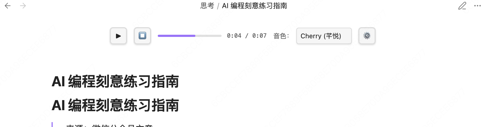
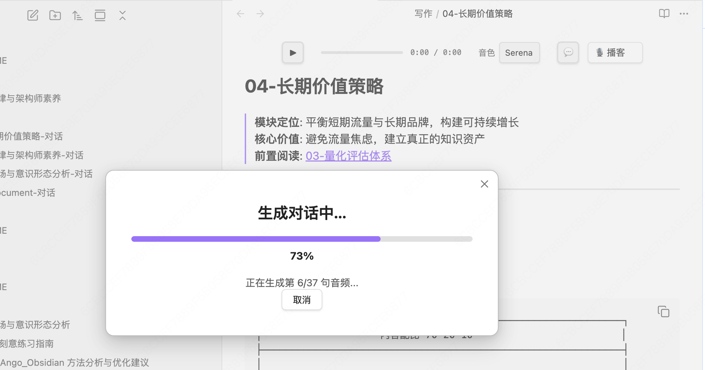
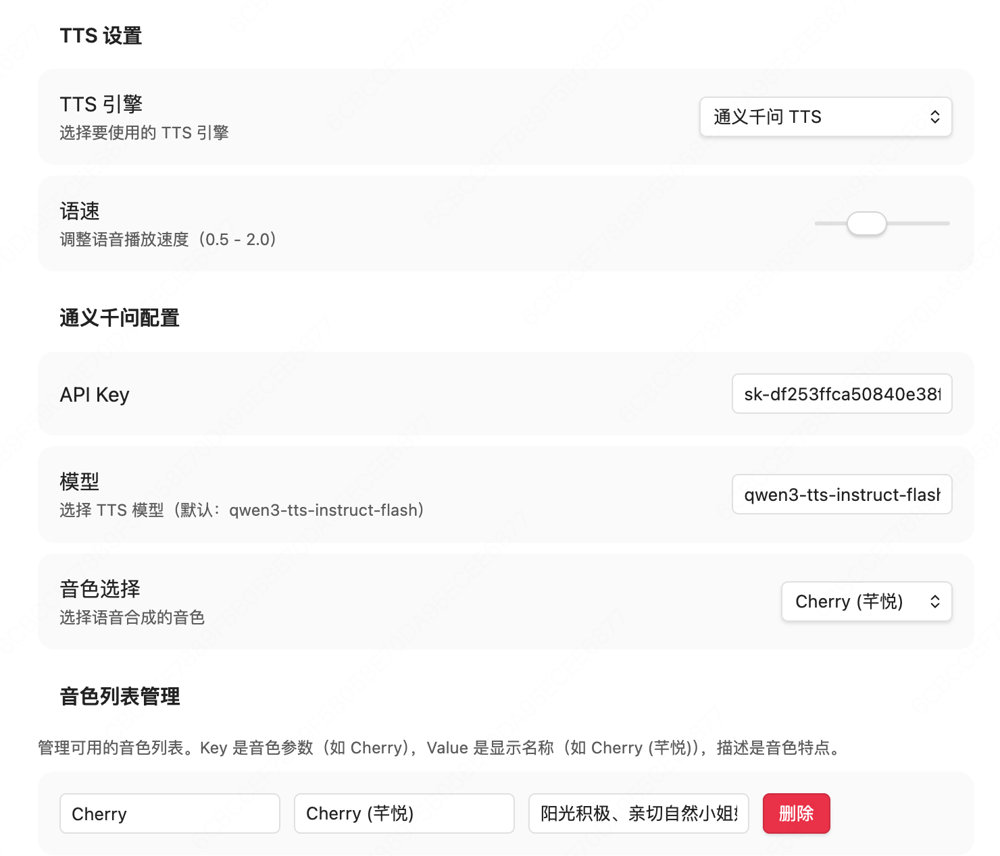

# Voice Notes - AI Dialogue

🎙️ 将你的 Obsidian 笔记转化为生动的 AI 对话！支持多音色 TTS、NotebookLM 风格的对话式学习，让知识"听"起来更有趣。


## 📸 界面预览

### 控制条界面


简洁的单行控制条，包含播放控制、进度显示、音色选择和对话模式切换。

### 对话生成流程


AI 自动将笔记转换为多人对话，支持进度显示和取消操作。

### 设置面板


灵活的配置选项，支持多引擎、多音色管理。

## ✨ 特性

### 🎯 核心功能
- **🎙️ AI 对话生成**：将笔记转换为多人对话，NotebookLM 式学习体验
  - 📚 5 种预设模板：单人讲解、双人对话、三人课堂、双人辩论、访谈模式
  - 🎭 3 种对话风格：正式、轻松、幽默
  - 🎨 智能角色分配：每个模板预设不同人格和音色
- **🎵 多音色 TTS**：支持 11+ 种预设音色，每个角色独立配置
- **🔄 多引擎支持**：通义千问 TTS、Web Speech API、OpenAI TTS
- **📝 智能解析**：自动处理 Markdown 语法，过滤无意义内容
- **⚡ 音频缓存**：WAV 格式合并缓存，秒速播放
- **📊 实时进度**：进度条实时更新，显示播放时间
- **🎬 播放控制**：速度调节（0.5x - 2.0x）、进度跳转（点击/拖动）

### 🎨 界面设计
- **紧凑单行布局**：不占用过多笔记空间
- **居中对齐**：视觉平衡，美观大方
- **柔和交互**：细边框、悬停效果、平滑过渡
- **主题适配**：完美融入 Obsidian 深色/浅色主题

### 🔧 智能解析
自动处理以下 Markdown 元素：
- ✅ 移除 YAML frontmatter
- ✅ 移除水平分隔线（`---`, `***`, `___`）
- ✅ 移除图片、数学公式
- ✅ 转换代码块为"代码块"提示
- ✅ 标题转换为自然停顿（添加句号）
- ✅ 链接只读显示文本
- ✅ 移除格式标记（粗体、斜体、删除线、高亮）
- ✅ 移除列表标记符号

## 📦 安装

### 方法 1：手动安装（推荐）

1. 下载最新的 Release
2. 解压到 Obsidian vault 的 `.obsidian/plugins/obsidian-tts/` 目录
3. 重启 Obsidian 或重新加载插件
4. 在设置中启用 "Obsidian TTS"

### 方法 2：开发模式安装

```bash
# 克隆仓库
git clone https://github.com/your-username/obsidian-tts-plugin.git
cd obsidian-tts-plugin

# 安装依赖
npm install

# 构建插件
npm run build

# 复制到 Obsidian vault
cp main.js styles.css manifest.json /path/to/your/vault/.obsidian/plugins/obsidian-tts/
```

## 🚀 使用指南

### 🎧 音频演示

想先听听效果？点击下方播放对话模式生成的示例音频：

<audio controls>
  <source src="assets/dialogue-demo.wav" type="audio/wav">
  您的浏览器不支持音频播放。
</audio>

> 这是一个真实的对话模式生成示例，展示了三个角色的自然对话效果。

### 基本使用

#### 普通朗读模式

1. 打开任意 Markdown 笔记
2. 控制条会自动出现在笔记标题下方
3. 点击 ▶ 按钮开始播放
4. 使用 ⏸ 暂停/继续，⏹ 停止播放

#### 💬 对话模式（推荐用于学习）

1. 打开要学习的 Markdown 笔记
2. 点击 💬 按钮启动对话模式
3. 在配置对话框中选择：
   - **模板**：
     - 📖 **单人讲解**：适合知识传授、教程
     - 💬 **双人对话**：适合轻松讨论、播客
     - 📚 **三人课堂**：适合深度学习、课堂（讲师 + 好奇学生 + 批判学生）
     - ⚔️ **双人辩论**：适合观点碰撞、辩论
     - 🎙️ **访谈模式**：适合人物采访、话题访谈
   - **风格**：
     - **正式**：语言规范、逻辑严密，适合学术、技术文档
     - **轻松**：语言通俗、比喻生动，适合科普、生活类内容
     - **幽默**：加入幽默元素、俏皮话，适合娱乐、趣味内容
4. AI 根据你的选择将文档转换为对话
5. 等待生成完成（10-30 秒，取决于文档长度）
6. 自动开始播放对话
7. 对话脚本自动保存到 `对话记录/文档名-对话.md`，可重复播放和编辑

**对话长度自适应**：
- 短文档（< 1000 字）：约 5 分钟对话（12 轮）
- 中等文档（1000-3000 字）：约 15 分钟对话（20 轮）
- 长文档（> 3000 字）：约 30 分钟对话（35 轮）

### 配置 TTS 引擎

#### 通义千问 TTS（推荐）

1. 打开 Obsidian 设置 → TTS 设置
2. 选择 TTS 引擎：**通义千问 TTS**
3. 输入你的 API Key（从[阿里云 DashScope](https://dashscope.console.aliyun.com/) 获取）
4. 选择模型（默认：`qwen3-tts-instruct-flash`）
5. 选择音色（11 种预设音色可选）

#### Web Speech API（无需配置）

- 使用浏览器内置 TTS，无需 API Key
- 质量较低，但即开即用

### 音色管理

#### 预设音色
- **Cherry (芊悦)**：阳光积极、亲切自然小姐姐（女性）
- **Serena (苏瑶)**：温柔小姐姐（女性）
- **Ethan (晨煦)**：阳光、温暖、活力、朝气（男性）
- **Chelsie (千雪)**：二次元虚拟女友（女性）
- **Momo (茉兔)**：撒娇搞怪，逗你开心（女性）
- **Vivian (十三)**：拽拽的、可爱的小暴躁（女性）
- **Moon (月白)**：率性帅气的月白（男性）
- **Maia (四月)**：知性与温柔的碰撞（女性）
- **Kai (凯)**：耳朵的一场SPA（男性）
- **Nofish (不吃鱼)**：不会翘舌音的设计师（男性）
- **Bella (萌宝)**：喝酒不打醉拳的小萝莉（女性）

#### 自定义音色

1. 在设置中找到"音色列表管理"
2. 点击"+ 添加音色"
3. 填写：
   - **Key**：音色参数（如 `Alloy`）
   - **Value**：显示名称（如 `Alloy (合金)`）
   - **描述**：音色特点（可选）
4. 保存后即可在控制条中选择

### 快捷操作

- **切换文档**：自动停止当前播放
- **音色切换**：在控制条上直接切换，无需进入设置
- **速度调节**：在控制条选择 0.5x、0.75x、1.0x、1.25x、1.5x、2.0x
- **进度跳转**：点击进度条快速跳转到任意位置（支持普通模式和对话模式）
- **自定义音色输入**：点击 ⚙ 按钮展开输入框
- **对话文件管理**：
  - 首次生成：自动保存到 `对话记录/文档名-对话.md`
  - 自动创建：`对话记录` 文件夹（如不存在）
  - 再次点击 💬：选择"使用现有"或"重新生成"
  - 手动编辑：可直接编辑对话文件内容
  - 集中管理：所有对话文件统一存放，便于查找

## 🎛️ 配置选项

### 通用设置
- **TTS 引擎**：选择使用的 TTS 服务
- **播放速度**：0.5x - 2.0x（默认 1.0x），可在控制条实时调节

### 通义千问 TTS 设置
- **API Key**：DashScope API 密钥
- **TTS 模型**：语音合成模型（默认：qwen3-tts-instruct-flash）
- **对话生成模型**：用于生成对话脚本的文本模型（默认：qwen3.5-plus）
- **音色**：从预设列表中选择（普通朗读模式使用）
- **对话模板音色配置**：为每个对话模板的每个角色单独配置音色
  - 单人讲解：[讲解者]
  - 双人对话：[对话者A, 对话者B]
  - 三人课堂：[讲师, 好奇学生, 批判学生]
  - 双人辩论：[正方, 反方]
  - 访谈模式：[主持人, 嘉宾]

### 音色列表管理
- **添加**：点击"+ 添加音色"按钮
- **编辑**：直接修改 Key、Value、描述
- **删除**：点击"删除"按钮移除音色

## 🛠️ 开发

### 项目结构

```
obsidian-tts-plugin/
├── src/
│   ├── main.ts                 # 主插件类
│   ├── settings.ts             # 设置管理
│   ├── tts/
│   │   ├── engine-manager.ts   # TTS 引擎管理器
│   │   └── engines/
│   │       ├── base.ts         # 引擎接口定义
│   │       ├── web-speech.ts   # Web Speech API
│   │       ├── qwen.ts         # 通义千问 TTS
│   │       └── openai.ts       # OpenAI TTS
│   ├── dialogue/               # 💬 对话模式模块
│   │   ├── types.ts            # 类型定义
│   │   ├── dialogue-generator.ts    # AI 对话生成
│   │   ├── dialogue-parser.ts       # 对话解析
│   │   ├── dialogue-file-manager.ts # 文件管理
│   │   ├── multi-voice-player.ts    # 多音色播放
│   │   ├── dialogue-progress-modal.ts # 进度提示
│   │   └── dialogue-options-modal.ts  # 选项对话框
│   ├── parser/
│   │   └── content-parser.ts   # Markdown 解析器
│   ├── ui/
│   │   ├── controller.ts       # UI 控制器
│   │   └── styles.css          # 样式文件
│   └── utils/
│       └── language-detector.ts # 语言检测
├── docs/
│   ├── plans/                  # 设计文档
│   ├── TESTING.md              # 测试清单
│   └── INSTALLATION.md         # 安装指南
├── manifest.json               # 插件元信息
├── package.json
├── tsconfig.json
└── esbuild.config.mjs          # 构建配置
```

### 开发命令

```bash
# 安装依赖
npm install

# 开发模式（自动重新编译）
npm run dev

# 生产构建
npm run build
```

### 添加新的 TTS 引擎

1. 在 `src/tts/engines/` 创建新引擎文件
2. 实现 `ITTSEngine` 接口
3. 在 `engine-manager.ts` 中注册引擎
4. 在 `settings.ts` 中添加配置 UI

## 💡 使用示例

### 对话模式示例

假设你有一篇关于"人工智能"的笔记：

```markdown
# 人工智能简介

人工智能（AI）是计算机科学的一个分支...

## 机器学习
机器学习是 AI 的核心技术...

## 应用场景
AI 已经广泛应用于各个领域...
```

点击 💬 按钮，选择"三人课堂"模板后，AI 会生成类似这样的对话：

```markdown
[讲师]: 今天我们来讨论人工智能这个话题。人工智能，简称 AI，是计算机科学的一个重要分支。

[好奇学生]: 老师，人工智能具体是做什么的呢？

[讲师]: 好问题！简单来说，人工智能就是让计算机模拟人类的智能行为，比如学习、推理、解决问题等。

[批判学生]: 那人工智能和普通的计算机程序有什么本质区别吗？

[讲师]: 很好的问题！普通程序是按照固定规则执行，而 AI 可以从数据中学习并改进自己的表现...
```

播放时会自动使用三种不同的音色（讲师、好奇学生、批判学生），让学习体验更生动有趣！

**其他模板示例**：

- **单人讲解**：适合纯知识传授，一个人清晰讲解
- **双人对话**：两个人轻松讨论，像播客一样
- **双人辩论**：正反方观点碰撞，适合有争议的话题
- **访谈模式**：主持人提问，嘉宾回答，适合人物介绍或深度话题

### 对话文件结构

生成的对话文件保存在 `对话记录/` 文件夹中，格式如下：

**文件路径**：`对话记录/笔记名-对话.md`

**文件内容**：
```markdown
---
generated: 2026-03-06T10:30:00Z
source: 子目录/人工智能简介.md
sourceName: 人工智能简介.md
type: dialogue
dialogueLines: 35
characters: 2500
templateId: classroom
style: casual
---

# 对话脚本

> 本文件由 AI 自动生成，用于多人对话式 TTS 播放
>
> 📄 源文件：`子目录/人工智能简介.md`
> 🎭 对话行数：35
> 📝 字符数：2500
> 🕐 生成时间：2026/3/6 18:30:00

---

## 对话内容

[讲师]: ...
[好奇学生]: ...
[批判学生]: ...
```

你可以：
- 📁 在 `对话记录/` 文件夹中统一查看所有对话
- ✏️ 直接编辑对话内容
- 🔄 点击 💬 选择"重新生成"
- ♻️ 点击 💬 选择"使用现有"重复播放
- 🔗 通过 frontmatter 的 `source` 字段追溯原文档

## 🐛 已知问题

- [ ] 阿里云、腾讯云 TTS 引擎待完善
- [ ] 音频缓存在某些情况下可能保存失败（Electron 沙箱限制），但不影响播放

## 🗺️ 路线图

### v0.2.0 ✅
- [x] 基础 TTS 功能（多引擎支持）
- [x] 智能 Markdown 解析
- [x] 音色管理和自定义
- [x] **💬 对话模式**（AI 生成多人对话）
- [x] 多音色自动切换
- [x] 对话文件管理
- [x] **⚡ 音频缓存**（WAV 格式合并）
- [x] 取消生成支持
- [x] 防重复点击保护
- [x] 优化控制条布局

### v0.3.0（当前版本）✅
- [x] **播放控制增强**
  - [x] 播放速度控制（6档：0.5x - 2.0x）
  - [x] 进度条点击/拖动跳转（普通模式 + 对话模式）
- [x] **对话模式增强**
  - [x] 5种预设角色模板（单人讲解、双人对话、三人课堂、双人辩论、访谈模式）
  - [x] 3种对话风格（正式、轻松、幽默）
  - [x] 每个模板支持独立音色配置
  - [x] 音色配置系统重构（移除旧的 education/podcast 模式）
- [x] **用户体验优化**
  - [x] 标题转换为自然停顿（不再朗读"一级标题"等）
  - [x] 对话配置 Modal 优化
  - [x] 音频缓存路径优化

### v0.4.0（计划中）
- [ ] 播放历史记录
- [ ] 多引擎完善（阿里云、腾讯云）
- [ ] 导出音频文件
- [ ] 对话模式高级功能：
  - [ ] 流式生成（边生成边播放）
  - [ ] 对话大纲预览和编辑
  - [ ] 多语言对话生成

## 📄 许可证

MIT License

## 🙏 致谢

- [Obsidian](https://obsidian.md/) - 强大的笔记应用
- [阿里云 DashScope](https://dashscope.console.aliyun.com/) - 提供通义千问 TTS API
- 所有贡献者和用户

## 📮 反馈与支持

- **Issues**：[GitHub Issues](https://github.com/your-username/obsidian-tts-plugin/issues)
- **讨论**：[GitHub Discussions](https://github.com/your-username/obsidian-tts-plugin/discussions)

---

**如果这个插件对你有帮助，请给个 ⭐️ Star 支持一下！**
